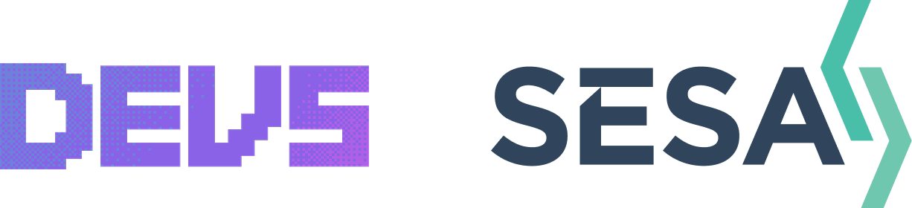

# DEVS x SESA Beginner Hackathon 2026

<p align="center">
  
</p>

<p align="center">
  
  
  
  
  
</p>

## 💻 About

Hi 😊! This is the template repository for the DEVS x SESA Beginners Hackathon 2026. You’re welcome to make any changes, and you don’t have to stick with everything provided here. This is simply a starter using HTML/CSS/TypeScript that you can build on.

If you have any questions, don’t hesitate to ask for help! Otherwise, we wish you all the best and hope you have a great time ❤️!

## 🚀 Getting Started

**1. Clone the Repository**

```bash
git clone <your-repo-url>
```

**2. Open the Project**

Open the folder in your preferred editor.

**3. Install Dependencies**

Open the terminal inside your editor (or an external terminal!) and run the following command from the root directory:

```bash
npm install
```

**4. Run**

From the same directory, run the following command to start the app. You can then access it in your browser at the URL shown in the terminal (usually `http://localhost:5173`).

```bash
npm run dev
```

## ⚛️ React Fundamentals

### Components

Reusable components live in the `src/components/` folder. Components are simply functions that return JSX - which is just HTML-like syntax that describes what to show on screen.

A sample component that takes in a string/text and displays it would look something like this:

```typescript
function MyComponent({ text }: { text: string }) {
  return (
    <div>
      <h1>{text}</h1>
    </div>
  )
}

export default MyComponent
```

#### Styling

To style a component, create a `.module.css` file next to it and import it. For example, in `MyComponent.module.css`:

```css
.title {
  color: coral;
}
```

Then we can use it in our component with `className={styles.title}`, to style our text coral:

```typescript
import styles from "./MyComponent.module.css"

function MyComponent({ text }: { text: string }) {
  return <h1 className={styles.title}>{text}</h1>
}
```

---

### Pages

Pages live in the `src/pages/` folder, each in its own folder (i.e. `src/pages/home/`). Pages are just components, however they often contain multiple components! Think of a page being a webpage that embeds multiple components!

For example, a page could use the `MyComponent` component above twice with different text:

```typescript
import MyComponent from "../../components/MyComponent"

function MyPage() {
  return (
    <div>
      <MyComponent text="Hello!" />
      <MyComponent text="Welcome to my website!" />
    </div>
  )
}

export default MyPage
```

This creates a webpage that displays "Hello!" and "Welcome to my website!" in coral text 🪸

## 🌲 Project Structure

#### `main.tsx`

This file largely doesn't need to be touched! It's the entry point of the app 😄.

---

#### `App.tsx`

This is where routing lives. It maps URLs to pages. `/` shows `Home`, `/about` shows `About`.

If you want to add a new page, this is the place to do it! Create a new folder in `pages/`, import it here, and add a new <Route> pointing to it.

```typescript
import PageName from "./pages/page-name/PageName";

// Then inside <Routes>
<Route path="/your-path" element={<PageName />} />
```

---

#### `Home.tsx`

The landing page. Displays the DEVS x SESA banner with the logo, three info cards, and a button to the API example page.

---

#### `ApiExample.tsx`

A page that demonstrates how to fetch data from an API. It uses the [PokeAPI](https://pokeapi.co/) to fetch a random Pokemon when a button is pressed. The left side shows the steps, the right side lets you try it out.

---

#### `Button.tsx`

A reusable pill-shaped button component that links to a page. Takes `text` and `to` as input.

```typescript
<Button text="Click Me" to="/some-page" />
```

## 🌏 Deployment

Your repository is automatically deployed via GitHub Pages. This means that it is live, and every time your main branch is updated, the site will be rebuilt and redeployed automatically!
